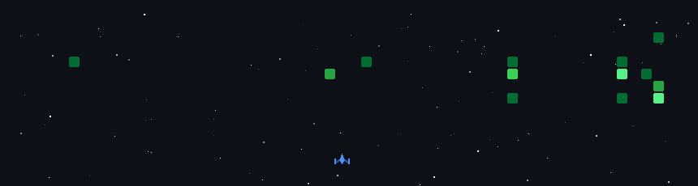

<div align="center">
  

# 🚀 Hi there, I'm Haikal!


<br>


</div>

---

# 🌌 About Me

```yaml
Name: Haikal Rayadi
Location: Pekanbaru, Indonesia 🇮🇩
Education: Politeknik Caltex Riau
Major: Information Technology

Interests:
  - Android Development
  - Web Development
  - GIS & Spatial Analysis
  - Machine Learning
  - Natural Language Processing

Current Goals:
  - Building impactful software
  - Learning Deep Learning
  - Improving UI/UX Design
  - Exploring AI Technologies
```

<p align="center">
Seorang mahasiswa IT yang berfokus pada pengembangan perangkat lunak modern, mulai dari aplikasi mobile, sistem informasi geografis, hingga eksplorasi data menggunakan Machine Learning.
</p>

---

---

# 🏆 GitHub Achievements

<div align="center">


<br>


</div>

---

# ⚡ Tech Stack & Tools

<div align="center">

### 📱 Mobile & Frontend


### 🖥️ Backend & GIS


### 🤖 AI & Data Science


### 🛠️ Tools & Software


</div>

---

# 👾 Take a Break — Space Shooter

<div align="center">



<br><br>

🎮 A mini-game project built to explore game mechanics, collision detection, and interactive UI design.

⭐ Challenge yourself and see how long you can survive in space!

</div>

---

# 🚀 Featured Projects

<table>
<tr>

<td width="50%">

### 📱 FitCal Pro

AI-powered mobile application for predicting daily calorie expenditure based on user activities.

**Tech Stack**

* Kotlin
* TensorFlow Lite
* Android Studio

</td>

<td width="50%">

### 🗺️ SIG Bank Sampah Kota Pekanbaru

WebGIS application for mapping waste bank locations and analyzing waste volume distribution.

**Tech Stack**

* Leaflet
* Laravel
* MySQL

</td>

</tr>

<tr>

<td width="50%">

### 📊 Big Data Analysis

Health insurance claims analytics using distributed data processing techniques.

**Tech Stack**

* PySpark
* Hadoop
* Python

</td>

<td width="50%">

### 🎬 Animasi 3D Legenda Putri Tujuh

Interactive educational media introducing local cultural heritage through 3D animation.

**Tech Stack**

* Blender
* Unity
* MDLC

</td>

</tr>
</table>

---

# 🏆 GitHub Achievements

<p align="center">
  
</p>

---

# 📊 GitHub Analytics

<div align="center">


</div>

<br>

<p align="center">
  
</p>

---

# 📈 Activity Metrics

<p align="center">
  
</p>

---

# 🐍 Contribution Snake

<p align="center">
  
</p>

---

# 🧊 3D Contribution Graph

<p align="center">
  
</p>

---

# 💡 Fun Facts

<div align="center">

🗺️ Passionate about GIS and Spatial Data Analysis

🤖 Exploring Machine Learning and NLP

☕ Coffee-powered coding sessions

🎮 Enjoy building interactive applications and mini games

🚀 Always learning something new

📍 Interested in combining AI with spatial technology

</div>

---

# 🎯 Current Focus

```text
📱 Android Development
🗺️ WebGIS & Spatial Analysis
🤖 Machine Learning
🌐 Full Stack Development
🎨 UI/UX Improvement
```

---

# 📬 Connect With Me

<p align="center">

<a href="https://linkedin.com/in/UsernameLinkedInKamu" target="_blank">
  
</a>

<a href="https://haikal-portofolio.vercel.app/" target="_blank">
  
</a>

<a href="mailto:EmailKamu@gmail.com">
  
</a>

</p>

---

<div align="center">

### ⭐ Thanks for visiting my profile!


</div>
