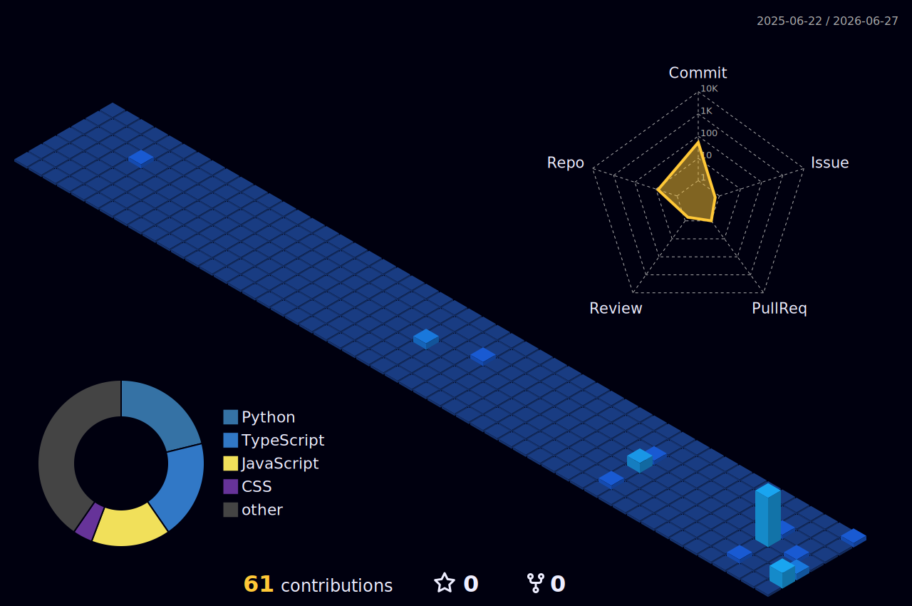

  

<h1 align="center">Hi there, I'm Haikal! 👋</h1>

  

  Seorang mahasiswa IT yang berfokus pada pengembangan perangkat lunak modern, mulai dari aplikasi <i>mobile</i>, pemetaan tata ruang spasial, hingga eksplorasi data menggunakan <i>Machine Learning</i>.

---

### 🚀 Highlight Proyek & Portofolio

Daripada hanya menulis keahlian, ini adalah beberapa proyek utama yang sedang/telah saya kembangkan:

- 📱 **FitCal Pro:** Aplikasi berbasis AI untuk memprediksi pengeluaran kalori harian berdasarkan aktivitas fisik pengguna.
- 🗺️ **SIG Bank Sampah Kota Pekanbaru:** Sistem Informasi Geografis berbasis web menggunakan Leaflet untuk pemetaan dan analisis volume sampah.
- 📊 **Big Data Analysis (PySpark):** Pemrosesan dan analisis data klaim asuransi kesehatan menggunakan *pipeline* Big Data.
- 🎬 **Animasi 3D Legenda Putri Tujuh:** Perancangan media edukasi budaya interaktif menggunakan metode pengembangan MDLC.

---

### 🛠️ Tech Stack & Tools

  
  
  
   
  
  
  
  
   
  
  

---

### 📊 GitHub Analytics
### 🧊 3D Contribution Graph

  

  <!-- GitHub Streak Stats (Server ini sangat tahan banting dan stabil) -->
  

  <!-- GitHub Metrics by Lecoq (Provider alternatif yang jauh lebih lengkap dan elegan) -->
  

---

### 📬 Mari Terhubung

  
  
  

